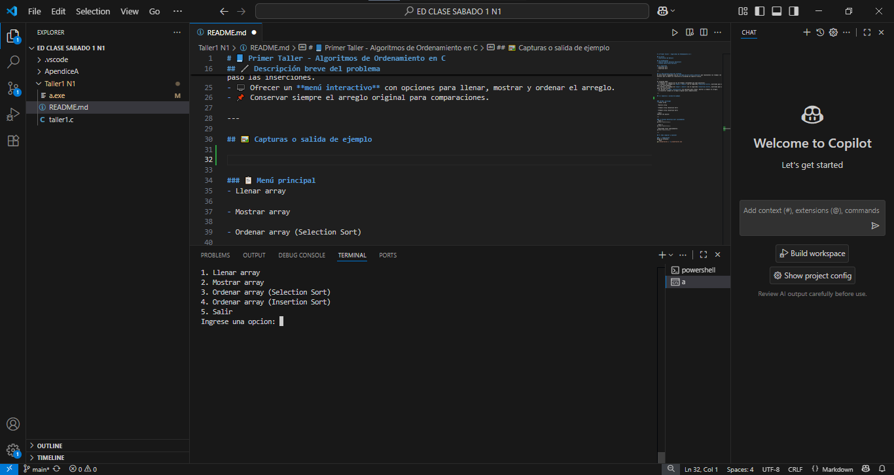
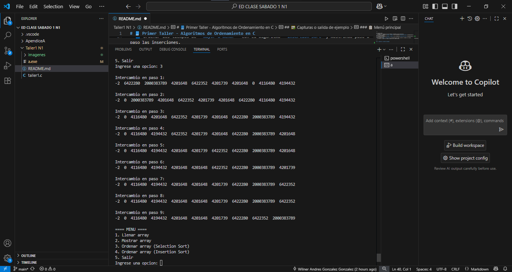
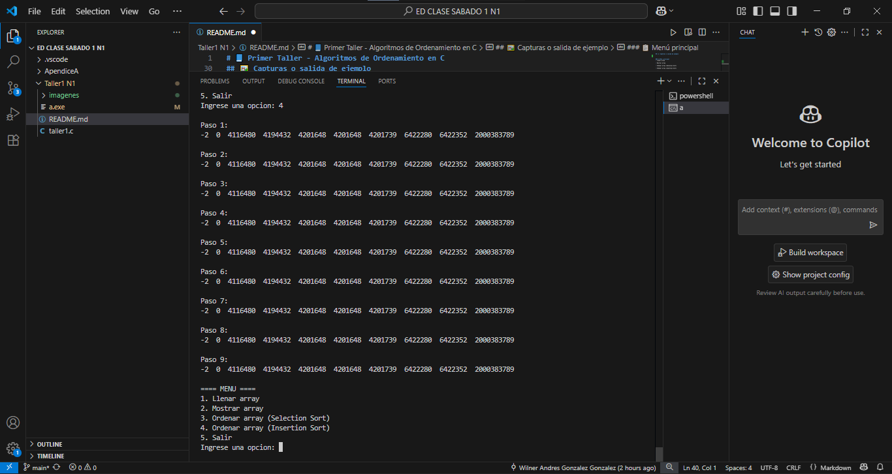

# 📘 Primer Taller - Algoritmos de Ordenamiento en C

## 📚 Curso  
- **Estructura de Datos**

## 👤 Integrantes 
- **Wilner Andres Gonzalez Gonzalez**
- **Yenny Paola Bravo Garces**

## 📝 Algoritmo
- Selection Sort
- Insertion Sort

---

## 🖊️ Descripción breve del problema  
En este taller trabajamos con un **arreglo de 10 números enteros** que representan los tiempos (en minutos) que se demora en resolverse un problema de soporte técnico. 

---

El programa debe:  
- ✍️ Permitir el ingreso de los 10 tiempos (validando que sean positivos).  
- 🔽 Ordenar los tiempos de **menor a mayor** con el algoritmo **Selection Sort**, mostrando paso a paso los intercambios.  
- 🔼 Ordenar los tiempos de **mayor a menor** con el algoritmo **Insertion Sort**, mostrando paso a paso las inserciones.  
- 🖥️ Ofrecer un **menú interactivo** con opciones para llenar, mostrar y ordenar el arreglo.  
- 📌 Conservar siempre el arreglo original para comparaciones.  

---

## 🖼️ Capturas o salida de ejemplo  

### Menú principal del programa


### Ordenamiento con Selection Sort


### Ordenamiento con Insertion Sort


---

### 📋 Menú principal
- Llenar array

- Mostrar array

- Ordenar array (Selection Sort)

- Ordenar array (Insertion Sort)

- Salir 
- Ingrese una opcion:

---

### 🔽 Proceso Selection Sort (ascendente)
- Paso 1:
10 9 8 7 6 5 4 3 2 1

- Paso 2:
10 9 8 7 6 5 4 3 2 1
...
- Resultado final (descendente): 
10 9 8 7 6 5 4 3 2 1

---

## ⚙️ Cómo compilar y ejecutar  

### 🛠️ Compilación  
Desde la terminal:  
```bash
gcc primertaller.c -o primertaller.exe